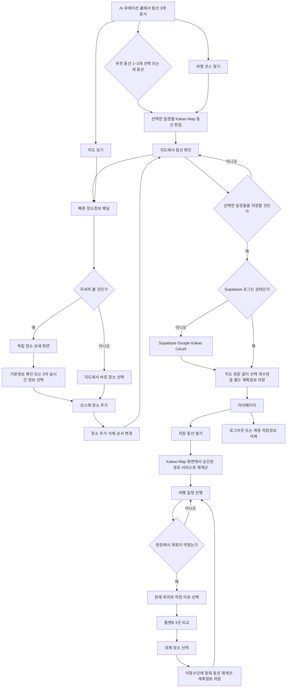

# 이천 세이브포인트 PRD
상태: 완료

> 근거 문서: `converted_markdown/2회차_답사계획서_이종석.md`, `converted_markdown/4회차_서비스기획서(1page)_이종석.md`
>
> 사용자는 2회차의 사전 코스 구성과 4회차의 현장 플랜B를 모두 제품 범위에 포함하기로 선택했습니다. 첫 화면의 AI 큐레이션 동선 3개, Kakao Map 단일 지도 화면, 경로 장애 시 외부 지도 전환, Supabase 데이터베이스와 OAuth 로그인, 마이페이지 일정 저장, 장소 상세정보, 이동수단별 동선 계획도 필수 요구사항입니다. TMAP 연동과 Kakao 지도 내부 교차 표시는 현재 계획에서 제외합니다. `(기준 초과 선택)`
>
> 지도·경로 공급자 검토 근거: `docs/research/map-provider-feasibility.md`

## 1. 서비스 한 줄 소개

서울·수도권에서 이천을 처음 당일치기로 방문하는 여행자가 첫 화면에서 AI가 큐레이션한 동선 3개를 보고 하나를 골라 Kakao Map에서 직접 수정하며, 경로 장애 시 외부 지도로 전환하고 저장할 때 Supabase OAuth로 로그인한 뒤 여행 중 계획이 막히면 플랜B 3곳으로 일정을 바꾸는 웹 서비스입니다.

## 2. 타깃과 문제 및 대체재

### 핵심 타깃

서울·수도권에서 이천을 처음 당일치기로 방문하는 20~40대 여행객 중, **대중교통을 이용하는 20~30대 친구·연인**과 **자가용을 이용하는 30~40대 가족**을 함께 대상으로 합니다. `(기준 초과 선택)`

- 친구·연인 여행객에게는 이천역 출발, 도보·대중교통 이동시간, 카페·공예·음식·산책 조합을 우선합니다.
- 가족 여행객에게는 주차, 아이 동반 가능 여부, 날씨·휴관 대응, 체험·식사·휴식 장소를 우선합니다.
- 두 집단은 추천 규칙과 장소 데이터가 다르므로 각각 별도의 테스트 시나리오로 검증합니다.

### 해결할 문제

여행 전에는 관광지·체험·카페·맛집 정보가 여러 플랫폼에 흩어져 있어 취향과 일정에 맞는 하루 코스를 만들고 장소 간 이동 순서를 판단하기 어렵습니다. 여행 중에는 예약 불가, 휴관, 비장날, 마감, 날씨 같은 변수를 뒤늦게 알면 다음 장소를 다시 검색해야 합니다. 이 과정에서 시간과 체력을 소모하고, 남는 시간을 지역 경험으로 연결하지 못합니다.

### 관찰 근거

- 이천역에서 교통을 기다리는 동안 옛 이천역 터를 그냥 지나칩니다.
- 설봉공원에서 더위·휴관으로 동선이 막힌 가족이 주차·운영 정보를 다시 찾습니다.
- 관고전통시장의 비장날·마감과 예스파크의 즉흥 체험 예약 불가로 다음 장소를 다시 검색합니다.

### 현재 대체재

- 여러 지도 앱에서 주변 장소와 이동시간을 각각 검색합니다.
- 여행 블로그·리뷰에서 운영 여부와 추천 코스를 다시 확인합니다.
- 인스타그램·릴스에서 이천 카페·맛집·데이트 장소를 탐색합니다.
- 기존 검색 방식은 정보가 플랫폼별로 흩어져 있고, “왜 계획이 막혔는지”에 맞춘 대체 동선을 한 번에 제안하지 않습니다.

### 확정된 범위와 주요 위험

- **확정된 범위:** 첫 화면 AI 큐레이션 동선 3개, Supabase Google·Kakao OAuth 로그인, Supabase 데이터베이스, Kakao Map 단일 지도 화면, 경로 장애 시 외부 Kakao Map 전환, 마이페이지, 장소 상세정보, 이동수단별 지도 동선 편집, 지도 원문을 제외한 일정 저장, 현장 플랜B 추천을 연결합니다.
- **범위 위험:** 여행 전 계획과 현장 구조는 이용 시점·화면·검증 기준이 달라, 1인 MVP의 일반적인 핵심 기능 1~2개 범위를 넘을 수 있습니다. `(기준 초과 선택)`
- **지도 위험:** 지도 표시뿐 아니라 장소 추가·삭제·순서 변경과 동선 재계산까지 포함하면 외부 지도 API(지도 기능을 빌려 쓰는 연결 통로)와 이동시간 계산이 필요합니다.
- **정보 신뢰 위험:** 모든 장소는 확인일이 표시된 직접 검증 정보를 기본으로 사용합니다. 실시간 정보는 연결 가능한 장소에서만 선택적으로 제공하며, 사용자가 기본 정보와 실시간 정보를 혼동하지 않도록 상태와 갱신시각을 구분해야 합니다.
- **로그인·개인정보 위험:** Supabase Auth가 Google·Kakao OAuth를 중계하고 저장 일정은 Supabase Postgres에 보관하므로 최소 수집, RLS, 로그아웃, 계정 삭제 기준이 필요합니다.
- **위치정보 위험:** 현장 플랜B에서 현재 위치를 사용할 때 명시적 동의를 받고, 권한을 거부한 사용자가 이천 내 권역이나 출발 장소를 직접 선택할 수 있어야 합니다.
- **이동수단 위험:** 도보·자차·대중교통은 경로 계산 방식과 필요한 정보가 달라 외부 경로 서비스 의존도가 커집니다.
- **지도 저장 위험:** 사용자 일정에 지도 타일·이미지·경로선·공급자 원문 응답을 저장하지 않습니다. 장소 순서와 내부 장소 ID만 저장하고 동선을 다시 열 때 현재 계획에서 승인된 Kakao 계열 경로 서비스로 재계산합니다.
- **확정된 공급자 정책:** 지도 화면과 장소 탐색은 Kakao Map으로 통일합니다. 기본 경로는 Kakao Map·Kakao Mobility 기능을 사용하고, 장애 대응은 외부 Kakao Map 열기로 처리합니다. TMAP 연동과 TMAP 경로의 Kakao 지도 내부 표시는 현재 계획에서 제외하고, 다시 도입한다면 외부 TMAP 전환부터 별도 계획으로 검토합니다.
- **AI 추천 위험:** AI 추천이 실패하거나 지연되면 내부 장소 데이터로 미리 계산한 기본 큐레이션 3개를 보여줘 첫 화면이 비지 않게 합니다.
- **확정된 실시간 정보 단계:** 선택형 실시간 장소정보는 2차 플랜B와 함께 추가합니다.
- **결정 상태:** 사용자 요청 수정사항과 최종 검증을 반영해 확정했습니다. 남은 핵심 미정 항목은 없습니다.

## 3. 핵심 기능과 부가 기능

### 1차 핵심 기능: AI 큐레이션 동선 추천·편집·저장

- 로그인 전 첫 화면에서 AI가 큐레이션한 이천 동선 3개를 항상 보여줍니다.
- 각 추천에는 대상 여행객, 이동수단, 예상 소요시간, 주요 장소, 추천 이유를 표시합니다.
- 새 동선 조건을 입력하면 성격이 다른 후보 동선 3개를 생성하고, 사용자가 비교해 1~3개를 복수 선택한 뒤 선택한 일정별로 지도에서 편집합니다.
- 사용자가 추천 동선 1~3개를 선택하면 각 일정을 독립된 Kakao Map 계획으로 열어 장소와 방문 순서를 보여줍니다. Kakao 계열 경로가 실패하면 외부 Kakao Map 전환을 제공합니다.
- 사용자가 지도에서 장소를 추가·삭제하고 방문 순서를 바꿀 수 있습니다.
- 순서나 이동수단을 바꾸면 연결 동선과 예상 이동시간을 다시 보여줍니다.
- 로그인 사용자의 편집 변경은 임시 초안으로 자동 보호하고, 저장 버튼을 눌렀을 때 확정 일정에 반영합니다.
- 선택한 일정은 선택 개수만큼 각각 별도 일정으로 저장합니다. 1개 선택 시 1개, 2개 선택 시 2개, 3개 선택 시 3개의 일정 카드가 마이페이지에 생성됩니다.
- 지도에서 장소를 선택하면 사진, 주소, 운영시간, 휴무일, 예약 필요 여부, 예상 체류시간, 추천 이유 등 상세정보를 보여줍니다.
- 저장 버튼을 누를 때 로그인하지 않은 사용자에게 Supabase Google·Kakao OAuth 로그인을 요청합니다.
- **이유:** 분산된 장소 정보를 실제로 이동 가능한 하루 일정으로 바꾸고, 사용자가 추천 결과를 직접 통제하게 합니다.
- **1차 필요성:** 추천을 먼저 체험하게 하고, 가치가 확인된 시점에만 로그인을 요구해 첫 진입 장벽을 낮춥니다.

### 2차 핵심 기능: 현장 플랜B로 일정 교체

- 위치 권한에 동의한 사용자는 현재 위치를 사용하고, 권한을 거부한 사용자는 이천 내 권역이나 현재 장소를 직접 선택합니다.
- 예약 불가, 휴관, 비장날·마감, 날씨, 남는 시간 등 막힌 이유를 선택합니다.
- 기존 일정에서 이용할 수 없는 장소를 대체할 플랜B 3곳을 보여줍니다.
- 대체 장소를 선택하면 기존 코스의 해당 장소를 바꾸고 이후 동선을 다시 계산합니다.
- 각 카드에는 추천 이유, 예상 이동시간·이동법, 운영·예약·장날 등 주의 조건을 표시합니다.
- **이유:** 사용자가 여러 플랫폼을 다시 검색하지 않고 기존 일정을 이어가게 합니다.
- **2차 필요성:** 1차에서 저장한 동선 데이터를 활용해 4회차 문서의 현장 구조 가치를 검증합니다.

### 단계별 출시 범위

#### 1차 출시

- 첫 화면에 AI 큐레이션 동선 3개 추천
- 후보 3개 중 1~3개 복수 선택, 선택 일정별 지도 편집, 선택 개수만큼 별도 일정 저장
- 여행 코스 찾기에서 대상 여행객·이동수단·소요시간·관심사로 공개 큐레이션을 탐색
- 여행 코스 찾기의 기본 정렬은 조건 적합도순이며 소요시간·최근 정보 확인순을 보조 정렬로 제공
- 지도 보기에서 이천의 검증된 장소를 지도와 목록으로 탐색하고 장소 상세 또는 새 동선으로 연결
- Kakao Map을 단일 지도 화면과 장소 탐색 인터페이스로 사용
- Kakao 계열 경로 장애 시 외부 Kakao Map 길찾기 전환 제공. TMAP 연동과 Kakao 지도 내부 교차 표시는 현재 출시 범위에서 제외
- 동선 저장 시 Supabase Auth를 통한 Google·Kakao OAuth 로그인
- Supabase Postgres와 RLS를 사용한 사용자별 동선 저장·조회·수정·삭제
- 마이페이지에서 새 동선 생성, 저장 동선 목록, 다시 열기, 수정·삭제
- 지도 안의 빠른 장소정보 패널과 독립된 장소 상세 화면
- 도보·자차·대중교통별 지도 동선 생성
- 장소 추가·삭제, 방문 순서·이동수단 변경, 동선 재계산
- 지도 원문 없이 장소 순서와 계획 정보만 저장하고 마이페이지에서 다시 열 때 동선 재계산

#### 2차 출시

- 현재 위치와 막힌 이유 선택
- 기존 일정의 막힌 장소를 대체할 플랜B 3곳 추천
- 대체 장소 선택 후 이동수단별 동선 재계산
- 변경한 동선을 기존 저장 일정에 반영
- 실시간 정보가 연결된 장소에 한해 사용자가 “실시간 정보 반영”을 켜는 선택 기능
- 실시간 정보 연결 실패 시 확인일이 표시된 기본 검증정보로 전환하고 실패 사실 안내

#### 후속 확장 후보

- TMAP을 다시 도입한다면 외부 앱·웹 전환부터 별도 계획으로 검토하고, 내부 교차 표시는 양사의 서면 승인 뒤에만 재검토

### 부가 기능 후보

- 포기한 장소를 “다음에 가기”로 저장합니다.
- 장소별 추천 시간대와 주의 조건을 자세히 보여줍니다.
- 15~30분 남는 시간에 볼 수 있는 로컬 스토리 카드를 제공합니다.
- 현장 QR로 현재 권역의 추천 화면을 바로 엽니다.
- 완성한 코스를 링크로 공유합니다.

### 시안 대조에서 제외한 기능

- 장소 즐겨찾기, 저장 동선 복제, 알림·알림 설정, 프로필 수정, 지도·스카이뷰 전환은 현재 제품 범위에 포함하지 않습니다.

### 사용자가 지정한 필수 지원 기능

#### Supabase Google·Kakao OAuth 로그인

- 첫 화면과 동선 편집은 로그인 없이 사용할 수 있습니다.
- 사용자가 동선을 저장하거나 마이페이지를 열 때 Supabase Auth의 Google 또는 Kakao OAuth 로그인을 요청합니다.
- Supabase Auth가 OAuth 콜백, 사용자 식별, 애플리케이션 세션을 관리합니다.
- 서비스는 로그인 제공자의 비밀번호와 별도 OAuth 공급자 토큰을 자체 테이블에 저장하지 않습니다.
- 사용자는 마이페이지에서 로그아웃하거나 계정과 저장 동선을 삭제할 수 있습니다.
- 계정 삭제는 삭제 대상과 되돌릴 수 없음을 안내하고 최종 확인한 뒤 계정과 모든 저장 동선을 즉시 영구 삭제합니다.
- 1차에서는 카카오 계정과 구글 계정을 하나의 서비스 계정으로 합치지 않고 별도 계정으로 처리합니다.
- **이유:** 여러 동선을 사용자별로 저장하고 다른 방문에서도 다시 열기 위해 필요합니다.

#### 마이페이지 일정 관리

- 로그인한 사용자는 마이페이지에서 새 동선을 계획하고 저장된 동선 목록을 확인합니다.
- 저장된 동선을 다시 열어 장소 추가·삭제, 방문 순서, 이동수단을 수정하거나 동선을 삭제할 수 있습니다.
- 각 동선에는 이름, 여행일, 동행 유형, 이동수단, 마지막 수정일을 표시합니다.
- **이유:** 여행 전 계획과 현장 변경을 같은 일정으로 이어서 관리하기 위해 필요합니다.

#### 장소 상세정보

- 장소명, 사진, 소개, 주소, 연락처, 운영시간, 휴무일, 장날, 예약 필요 여부, 주차 정보, 추천 체류시간, 출처와 확인일을 제공합니다.
- 지도에서 장소를 선택하면 빠른 정보 패널을 먼저 보여주고, 사용자가 “상세보기”를 선택하면 독립된 장소 상세 화면을 엽니다.
- 2차부터 실시간 정보가 지원되는 장소에는 “실시간 정보 반영” 선택 옵션과 마지막 갱신시각을 표시합니다.
- 실시간 옵션을 끄거나 지원하지 않는 장소에서는 확인 날짜가 표시된 기본 검증 정보를 사용합니다.
- **이유:** 사용자가 별도 검색 없이 코스에 장소를 넣을지 판단하게 합니다.

#### 이동수단별 동선

- 도보, 자차, 대중교통 중 하나를 선택해 장소 순서, 예상 이동시간, 이동 경로를 확인합니다.
- 이동수단을 바꾸면 전체 동선을 다시 계산합니다.
- 대중교통 다중 장소 일정은 사용자가 정한 방문 순서를 유지한 채 인접한 장소 사이를 구간별로 계산하고 연결합니다.
- **이유:** 같은 장소 조합도 이동수단에 따라 가능한 코스와 방문 순서가 달라집니다.

#### Kakao Map 단일 지도와 외부 지도 전환

- 서비스의 지도 화면, 장소 마커, 장소 탐색, 경로 표시는 Kakao Map으로 통일합니다.
- 도보·대중교통·자전거 경로는 Kakao Map 경로 API를, 자차 경로는 Kakao Mobility 경로 API를 우선 사용합니다.
- 현재 계획은 외부 Kakao Map 열기만 제공합니다. TMAP 연동은 현재 계획에 포함하지 않습니다.
- TMAP을 다시 도입한다면 외부 앱·웹 전환부터 별도 계획으로 검토합니다. Kakao 지도 내부 교차 표시는 양사의 서면 승인을 확보한 경우에만 후속 계획으로 재검토합니다.
- 사용자의 저장 일정에는 지도 타일, 지도 이미지, 경로 폴리라인, 길안내 단계, 공급자 원문 응답을 저장하지 않습니다.
- 사용자의 저장 일정은 자체 장소 ID, 방문 순서, 이동수단, 예상 체류시간만 보관합니다.
- 저장 동선을 다시 열면 최신 장소 좌표와 현재 승인된 경로 서비스로 경로·거리·이동시간을 새로 계산합니다.
- Kakao 계열 경로 장애 시 편집 중인 장소 목록과 방문 순서는 유지하고 재시도 또는 외부 Kakao Map 열기를 제공합니다.
- **이유:** 지도사 데이터 저장 문제를 줄이고 공급자를 바꿔도 사용자 계획 자체를 유지하기 위해 필요합니다.

#### Supabase 데이터베이스

- 애플리케이션 데이터베이스는 Supabase Postgres를 사용합니다.
- 공개 큐레이션·장소 데이터와 사용자별 저장 동선을 분리합니다.
- 사용자별 동선 테이블에는 RLS를 적용해 로그인한 사용자가 자신의 동선만 조회·수정·삭제할 수 있게 합니다.
- Supabase의 `service_role` 권한은 서버에서만 사용하고 브라우저에 노출하지 않습니다.
- **이유:** OAuth 사용자와 저장 동선의 소유권을 같은 사용자 ID로 연결하고 데이터 접근을 DB 단계에서 제한하기 위해 필요합니다.
- **기술 근거:** [Supabase Google OAuth](https://supabase.com/docs/guides/auth/social-login/auth-google), [Supabase Kakao OAuth](https://supabase.com/docs/guides/auth/social-login/auth-kakao), [Supabase RLS](https://supabase.com/docs/guides/database/postgres/row-level-security)

#### 공통 실패 처리

- AI 큐레이션 생성이 실패하거나 제한시간을 넘으면 미리 검수한 기본 큐레이션 3개를 보여줍니다.
- 지도·장소·경로 API 장애나 쿼터 초과가 발생해도 사용자가 편집 중인 장소 목록과 방문 순서는 유지합니다.
- 마지막 정상 계산시각과 실패 사유를 표시하고, 다시 계산 또는 외부 지도 열기를 제공합니다.
- 특정 구간의 경로가 없으면 해당 구간만 오류로 표시하고 다른 장소와 저장 동선은 유지합니다.
- Supabase 또는 OAuth 제공자 장애 시 다른 로그인 수단을 제공하고, 이미 로그인한 사용자의 유효한 Supabase 세션은 즉시 종료하지 않습니다.

## 4. 화면 목록과 이동 흐름

주 사용 기기: PC 및 모바일 모두 지원하며, 모바일 기준으로 설계한 뒤 PC에서 지도·일정 패널을 확장하는 반응형 디자인을 적용합니다.

### 1차 확정 화면

1. **AI 큐레이션 홈:** 로그인 없이 AI가 추천한 이천 동선 3개와 새 동선 만들기 제공
2. **지도 동선 계획 화면:** 선택한 추천 동선을 Kakao Map에 표시하고 장소 추가·삭제, 방문 순서·이동수단 변경, 빠른 장소정보 패널 제공. 경로 장애 시 외부 Kakao Map 전환 제공
3. **장소 상세 화면:** 전체 소개와 운영·예약·주차 정보 확인, 코스 추가. 2차부터 실시간 정보 반영 여부 선택 추가
4. **Supabase OAuth 로그인 화면:** 저장 또는 마이페이지 진입 시 Google·Kakao 로그인 선택
5. **마이페이지 화면:** 저장 동선 목록, 새 동선 만들기, 수정·삭제, 로그아웃, 계정·저장정보 삭제
6. **저장 동선 상세·여행 화면:** 저장된 장소 순서와 계획정보를 불러온 뒤 Kakao Map 화면에서 현재 승인된 경로 서비스로 경로를 재계산해 표시하고 여행 시작
7. **여행 코스 찾기 화면:** 공개 큐레이션을 대상 여행객·이동수단·소요시간·관심사로 탐색하고 선택한 코스를 지도 동선 계획 화면으로 연결
8. **지도 보기 화면:** 이천의 검증된 장소를 Kakao Map과 동등한 정보의 목록으로 탐색하고 장소 상세 또는 새 동선에 추가

### 2차 추가 화면

9. **플랜B 화면:** 막힌 이유 선택, 대체 장소 3곳 비교, 한 곳을 골라 기존 일정 교체

### 별도 시안으로 보강할 화면 상태

- AI 큐레이션 홈의 새 동선 조건 입력: 출발 위치, 여행시간, 동행 유형, 이동수단, 관심사
- 지도 동선 계획 화면의 장소 검색·검색 결과와 일정 추가 상태
- 마이페이지의 계정 및 저장정보 삭제 영향 안내·확인 상태
- OAuth 실패·취소 후 편집 중 동선을 유지하고 원래 화면으로 돌아가는 상태
- Kakao 계열 경로 실패 시 외부 Kakao Map 전환 상태

### 장소정보를 여는 두 가지 방법

- **빠르게 확인:** 지도 마커나 장소 카드를 선택하면 지도 안의 패널에서 핵심정보를 봅니다.
- **자세히 확인:** 패널의 “상세보기”를 선택하면 독립된 장소 상세 화면으로 이동합니다.
- 사용자는 상황에 따라 두 방법 중 하나를 선택할 수 있습니다.

## 5. 저장할 데이터와 데이터 사용 원칙

### 저장소

- 데이터베이스는 Supabase Postgres를 사용합니다.
- 로그인과 세션은 Supabase Auth를 사용합니다.
- 사용자 파일이 필요할 경우 Supabase Storage를 사용하되, 지도 타일·경로 이미지·공급자 응답 저장에는 사용하지 않습니다.

### 공개 데이터

- **장소:** 내부 장소 ID, 장소명, 권역, 주소, 자체 검증 좌표, 카테고리, 사진 사용권 정보, 연락처, 운영시간, 휴무일, 장날, 예약·주차 조건, 추천 체류시간, 정보 출처와 확인일
- **큐레이션:** 큐레이션 ID, 제목, 대상 여행객, 기본 이동수단, 예상 소요시간, 추천 이유, 장소 내부 ID 목록과 방문 순서
- **플랜B 규칙:** 막힌 이유, 추천 가능한 장소 유형, 거리·시간 조건, 추천 문구

### 사용자별 저장 데이터

- Supabase Auth 사용자 ID
- 동선 ID, 동선 이름, 여행일, 동행 유형, 이동수단, 생성일·수정일
- 선택한 큐레이션 ID 또는 새 동선 여부
- 동선별 내부 장소 ID, 방문 순서, 예상 체류시간
- 2차부터 플랜B로 교체된 내부 장소 ID와 변경된 방문 순서
- 2차부터 사용자가 실시간 정보 반영 옵션을 켰는지 여부

### 사용자 동선에 저장하지 않는 지도 정보

- Kakao Map 지도 타일·이미지·스크린샷과 TMAP 지도·경로 이미지
- 경로 폴리라인과 구간별 길안내 단계
- 공급자의 장소·경로 원문 응답과 거리·이동시간 스냅샷
- Kakao 장소 ID·상세 URL과 TMAP 경로 식별자·원문 URL
- 동선 저장 시점의 일시적인 현재 위치

저장 동선을 다시 열면 내부 장소 ID로 최신 좌표와 장소정보를 조회하고, Kakao Map 화면에서 현재 승인된 경로 서비스에 경로·거리·이동시간을 다시 요청합니다.

### 데이터 사용 원칙

- 개발·수업 중에는 실제 고객정보를 넣지 않고 테스트 계정과 가짜 사용자 데이터만 사용합니다.
- 실제 서비스에서는 Supabase OAuth 로그인과 일정 저장에 필요한 최소 개인정보만 수집하고, 수집 항목과 이용 목적을 로그인 전에 알립니다.
- Google·Kakao 계정의 비밀번호와 OAuth 공급자 토큰을 애플리케이션 테이블에 저장하지 않습니다.
- 사용자는 로그아웃하고 자신의 저장 일정과 계정을 삭제할 수 있어야 합니다.
- 현재 위치는 별도 동의를 받은 경우에만 요청하고, 권한 거부 시 수동 위치 선택을 제공합니다.
- 사용자가 동선의 출발지로 저장하지 않은 일시적인 현재 위치는 경로 계산 후 장기 보관하지 않습니다.
- 장소 정보는 지자체·공공데이터·장소 공식 채널처럼 출처를 확인할 수 있는 공개 정보를 사용합니다.
- 모든 장소에는 공개 정보를 직접 확인한 기본 검증정보와 확인 날짜를 제공합니다.
- 실시간 정보는 안정적인 연결 수단이 있는 장소에만 선택적으로 제공하고, 지원하지 않는 장소에는 실시간 상태라고 표시하지 않습니다.
- 사용자가 실시간 정보 반영을 선택해도 연결에 실패하면 기본 검증정보와 확인 날짜를 보여주고 실시간 확인 실패를 알립니다.
- 운영시간과 휴관 정보에는 출처와 확인 날짜를 함께 저장해 오래된 정보를 구분합니다.
- AI 큐레이션에는 자체 검증 장소 데이터만 사용하며 지도 공급자의 원문 응답을 AI 학습·재가공 데이터로 사용하지 않습니다.
- Supabase의 공개 스키마에 노출하는 모든 사용자 소유 테이블에 RLS를 적용합니다.
- 동선 조회·수정·삭제 정책은 `auth.uid()`와 동선의 `user_id`가 일치할 때만 허용합니다.
- 공개 장소·큐레이션 데이터는 비로그인 사용자에게 읽기만 허용하고 브라우저에서 수정할 수 없게 합니다.
- Supabase `service_role` 키, Kakao REST·Mobility 키, 선택적으로 사용하는 TMAP 서버 키는 서버 환경변수에만 보관합니다.

## 6. 제외 범위

### 1차에서 유예하고 2차에 추가

- 현장 플랜B 3곳 추천
- 막힌 장소 교체와 전체 동선 재계산
- 현장 변경 내용의 저장 일정 반영

### 후속 확장 범위

- TMAP 재도입 시 외부 전환부터 별도 계획으로 검토하고 내부 교차 표시는 양사 서면 승인 뒤에만 재검토

### 전체 제품 범위에서 제외

- 이메일·비밀번호를 직접 받는 자체 회원가입
- 카카오 로그인 계정과 구글 로그인 계정을 하나로 합치는 계정 연결
- 지도 타일·지도 이미지·경로 폴리라인·공급자 원문 응답의 사용자 동선 저장
- 결제, 체험 예약, 식당 예약
- 모든 장소의 실시간 혼잡도·잔여석 제공 보장
- 전국 또는 이천 외 지역 추천
- 자유 문장만으로 만드는 완전한 AI 여행 일정
- 사용자 리뷰, 커뮤니티, 공개 피드
- 관리자가 장소를 편집하는 별도 운영 화면
- 음성 안내와 턴바이턴 방식의 자체 내비게이션
- 장소 즐겨찾기와 저장 동선 복제
- 알림·알림 설정과 프로필 수정
- 지도·스카이뷰 전환
- 사용자 메모 저장

## 7. 성공 기준

대중교통 친구·연인 5명과 자가용 가족 5명을 별도 집단으로 테스트합니다.

1. **1차:** 각 집단 5명 중 4명 이상이 로그인 전에 AI 큐레이션 동선 3개를 확인하고 1~3개를 선택한 뒤, 선택한 일정별 Kakao Map에서 장소 1곳 이상을 수정하고 저장 시 Supabase Google·Kakao OAuth 로그인을 완료합니다. 마이페이지에는 선택 개수와 같은 수의 일정 카드가 생겨야 하며, 삭제한 일정은 목록에서 즉시 사라져야 합니다. 다시 연 각 동선은 저장된 장소 순서를 유지하며 Kakao Map 화면에서 현재 승인된 경로 서비스로 경로가 재계산되어야 합니다.
2. **2차:** 각 집단 5명 중 4명 이상이 대표 실패 상황에서 60초 안에 플랜B를 선택하고, 이동수단에 맞게 다시 계산된 일정과 장소정보가 기본 검증정보인지 실시간 정보인지 확인합니다.

## 8. 예상 복잡도

**전체는 큼, 1차도 큼** — 전체 화면이 9개이고, 1차만으로도 AI 큐레이션 3개 생성·대체 추천, 여행 코스 찾기, 지도 보기, Supabase Google·Kakao OAuth, Postgres·RLS, 사용자별 저장, 장소정보 두 가지 보기, 세 이동수단 경로, Kakao Map 편집과 외부 지도 전환을 연결해야 합니다. `(기준 초과 선택)`

복잡도를 높이는 요인은 AI 응답 실패 대응, Supabase OAuth 콜백과 세션, RLS 정책, Kakao Map·Kakao Mobility 연동, 외부 지도 전환, 경로 API별 차이, 장소 추가·삭제·순서 변경, 동선 재계산, 운영 정보 신뢰성, 2차 실시간 연결입니다. 지도 원문을 저장하지 않으므로 마이페이지에서 동선을 열 때마다 경로를 재계산해야 하며 API 장애·쿼터 초과 처리가 중요합니다.
