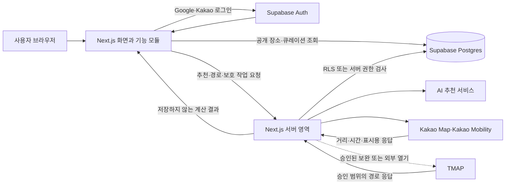

# 이천 세이브포인트 TRD
상태: 완료

## ① 선택한 스택과 이유 및 비교 대안

### 확정 스택

| 영역 | 선택 기술 | 맡는 역할 | 선택 이유 | 월 비용 | 나중에 바꾸려면 |
| --- | --- | --- | --- | --- | --- |
| 프론트엔드 | Next.js App Router + React + TypeScript | 사용자가 보는 반응형 화면, 지도·일정 편집 상태 | 화면과 서버 기능을 한 프로젝트에서 관리할 수 있고 학습 자료가 많음 | 로컬 $0 | 보통 |
| 스타일 | Tailwind CSS | 모바일 우선 화면과 PC 확장 레이아웃 | Next.js 기본 생성 도구에 포함되고 별도 UI 프레임워크 없이 시작 가능 | $0 | 쉬움 |
| 백엔드 | Next.js Route Handlers·Server Actions | AI 추천, 지도·경로 중계, 저장 검증, 계정 삭제처럼 비밀키가 필요한 작업 | 별도 Express 서버 없이 같은 프로젝트의 서버 영역에서 외부 API 키를 보호할 수 있음 | 로컬 $0 | 보통 |
| 데이터베이스 | Supabase Postgres | 장소, 공개 큐레이션, 사용자 동선과 방문 순서 저장 | PRD·FRD에서 확정됐고 관계형 데이터와 사용자별 RLS를 함께 지원 | 무료 구간 $0, Pro 월 $25부터 | 어려움 |
| 인증 | Supabase Auth | Google·Kakao OAuth, 세션, 사용자 식별 | 인증 사용자 ID와 동선 소유권을 같은 기반에서 연결 | Supabase 요금에 포함 | 어려움 |
| 로컬 개발 | Node.js + npm + Supabase 로컬 개발 환경 | `localhost`에서 화면·서버·DB를 실행 | 배포 계정 없이 핵심 흐름을 먼저 검증 가능 | $0 | 쉬움 |
| 선택 배포 | Vercel + Supabase Cloud | 개발 완료 뒤 인터넷 공개 | 로컬의 Next.js 구조를 큰 변경 없이 배포 가능 | 개인·비상업 학습은 $0 가능, 상용 기본선은 Vercel Pro 월 $20 + Supabase Pro 월 $25부터 | 보통 |

**선택 이유:** 지도 편집, OAuth 복귀, 서버 전용 외부 API 호출, 사용자별 저장을 하나의 코드베이스에서 다뤄야 합니다. Next.js는 사용자가 보는 화면과 뒤에서 일하는 서버 기능을 같은 프로젝트에 두면서도 폴더 경계를 나눌 수 있어 1인 AI 개발의 설정 수를 줄입니다. Supabase는 이미 확정된 Postgres·OAuth·RLS를 한 서비스에서 제공합니다.

구조는 **모듈러 모놀리식**으로 고정합니다. 이는 장소, 동선, 인증, 추천 같은 부서를 기능별 폴더로 나누되 한 건물, 즉 하나의 Next.js 프로젝트 안에 두는 방식입니다. MSA, Kubernetes 직접 운영, 이벤트 소싱, CQRS는 사용하지 않습니다.

### 비교한 대안

| 대안 | 장점 | 제외 이유 | 월 비용 | 나중에 선택안에서 바꾸려면 |
| --- | --- | --- | --- | --- |
| React·Vite + Express + Supabase | 화면과 서버 역할이 명확함 | 개발 서버와 배포 단위가 늘어 1인 MVP의 설정·오류 지점이 많음 | 로컬 $0, 배포 시 프론트·서버·Supabase 비용 | 보통 |
| Django + HTMX·JavaScript + Supabase | Python 중심 서버 개발과 관리 기능에 강함 | 지도 드래그·상태 동기화 같은 상호작용에 별도 JavaScript 작업이 커짐 | 로컬 $0, 배포 시 앱 서버·Supabase 비용 | 어려움 |
| Nuxt 또는 SvelteKit | 단일 프로젝트 풀스택 구성이 가능함 | 이 프로젝트가 필요한 Supabase OAuth·지도 UI의 학습 예제와 바이브코딩 자료가 상대적으로 적음 | 로컬 $0, 배포 후 사용량에 따라 유료 | 보통 |

### R1 비용 기준

- 1차 완료 기준인 로컬 실행은 월 $0입니다.
- Supabase Free는 월 $0이며 50,000 월간 활성 사용자, 500MB 데이터베이스, 1GB 파일 저장소, 5GB 전송량을 포함합니다. 1주 미사용 시 프로젝트가 일시 정지될 수 있습니다.
- Supabase Pro는 월 $25부터이며 자동 백업과 더 큰 데이터·전송 구간을 제공합니다.
- Vercel Hobby는 개인·비상업 프로젝트용 $0 플랜입니다. 실제 상용 서비스는 Vercel Pro 월 $20 개발자 좌석과 Supabase Pro 월 $25를 합친 약 월 $45부터를 기본선으로 봅니다.
- Gemini 2.5 Flash-Lite는 무료 등급에서 월 $0으로 시작합니다. 유료 전환 뒤 요청당 입력 2,000토큰·출력 600토큰을 가정하면 1,000회 약 $0.44입니다.
- Kakao 무료 쿼터와 초과 단가를 비용표에 반영했습니다. TMAP은 1차에 API를 연결하지 않아 비용이 발생하지 않습니다.

## ② 시스템 구조

브라우저는 화면과 편집 상태를 담당하고, 비밀키가 필요하거나 저장 권한을 검사해야 하는 작업은 Next.js 서버를 거칩니다. Supabase 브라우저용 공개 키는 RLS와 함께 사용하되, `service_role` 키와 지도·경로·AI 비밀키는 서버 환경변수에만 둡니다.



- 지도 화면과 장소 탐색은 Kakao Map으로 통일합니다.
- 자차 경로는 Kakao Mobility를 우선 사용합니다.
- 대중교통 다중 장소는 사용자가 정한 방문 순서를 유지하고 인접한 장소 사이를 구간별로 계산합니다.
- Kakao Map REST API의 대중교통·도보·자전거 경로 조회를 구간별로 호출하고, 여러 장소의 방문 순서는 애플리케이션이 연결합니다.
- TMAP은 1차 MVP에서 API를 호출하지 않고 외부 TMAP 열기만 제공합니다. 앱 내부 Kakao 지도 위 교차 표시는 양사 약관·라이선스와 비용을 확인한 뒤 별도 기능으로 추가합니다.
- AI·지도·경로 장애가 발생해도 브라우저의 장소 목록, 방문 순서, 이동수단은 유지합니다.
- 경로 응답은 화면에 표시한 뒤 폐기하고 저장 일정을 다시 열 때 최신 좌표와 승인된 공급자로 다시 계산합니다.

### AI 큐레이션 생성 방식

검증 규칙과 AI 설명을 결합합니다. AI가 존재하지 않는 장소나 불가능한 동선을 자유롭게 만들게 하지 않습니다.

AI 공급자는 Google Gemini API, 안정 모델 ID는 `gemini-2.5-flash-lite`로 확정합니다. 무료 등급에서 시작하며, 공급자 교체가 추천 규칙과 화면에 번지지 않도록 `AiRecommendationProvider` 인터페이스 뒤에 둡니다.

1. 서버가 `places`에서 확인일, 운영시간, 휴무일, 예약 필요 여부, 대상, 관심사에 맞는 장소만 고릅니다.
2. 이동수단과 여행시간을 기준으로 조합 가능한 후보와 방문 순서를 계산합니다.
3. AI에는 내부 장소 ID와 검증된 속성만 전달해 성격이 다른 후보 3개를 고르고 추천 이유를 구조화된 JSON으로 작성하게 합니다.
4. 서버가 AI 결과의 장소 ID, 중복, 시간 합계, 필수 필드를 다시 검사합니다.
5. 검사 실패·제한시간 초과·API 장애 시 `is_fallback = true`인 검수된 기본 큐레이션 3개를 즉시 보여줍니다.

AI 출력은 추천 후보를 만드는 일시적 계산 결과로 취급하고 전문을 데이터베이스나 로그에 저장하지 않습니다. 공개할 가치가 확인된 큐레이션만 운영 검수를 거쳐 `curations`와 `curation_stops`에 저장합니다.

- 무료 등급 입력·출력 비용은 $0이며 실제 호출 한도는 Google AI Studio의 프로젝트별 한도를 확인합니다.
- 유료 전환 시 표준 호출은 입력 100만 토큰당 $0.10, 출력 100만 토큰당 $0.40입니다.
- 요청당 입력 2,000토큰과 출력 600토큰을 가정하면 1,000회 호출 비용은 약 $0.44입니다.
- 무료 등급 데이터는 Google 제품 개선에 사용될 수 있으므로 이메일, 사용자 식별자, 현재 위치, 저장 일정 전체를 전송하지 않습니다.
- Google Search·Google Maps 그라운딩은 사용하지 않습니다. AI에는 내부 장소 ID와 검증된 비식별 속성만 전달합니다.
- 모델이 지원하는 구조화 출력을 사용하되, JSON 형식과 장소 ID·시간 합계 등 의미 검증은 서버에서 다시 수행합니다.
- `latest` 별칭은 모델이 자동 교체될 수 있어 사용하지 않고 안정 모델 ID를 환경변수로 지정합니다.

## ③ 데이터 모델

확정 일정은 관계형 테이블로 나누고, 자동 보호되는 편집 초안만 JSON 묶음으로 저장하는 혼합 구조를 사용합니다. 테이블은 엑셀 파일의 시트, 열은 각 시트의 입력 칸에 해당합니다.

### 공개·운영 데이터

| 테이블 | 주요 열 | 예시 한 줄 | 접근 규칙 |
| --- | --- | --- | --- |
| `places` | `id`, `name`, `category`, `latitude`, `longitude`, `address`, `phone`, `opening_hours`, `closed_days`, `market_days`, `reservation_required`, `parking_info`, `default_dwell_minutes`, `source_url`, `verified_at` | 설봉공원, 공원, 위도·경도, 90분, 2026-09-19 확인 | 모두 읽기, 쓰기는 서버 운영 절차만 |
| `place_media` | `id`, `place_id`, `asset_url`, `alt_text`, `license_source`, `display_order` | 설봉공원 전경, 대체문구, 사용권 출처, 1 | 모두 읽기, 쓰기는 서버 운영 절차만 |
| `curations` | `id`, `title`, `audience_type`, `transport_mode`, `duration_minutes`, `interest_tags`, `recommendation_reason`, `is_fallback`, `published_at` | 가족 도예·공원 코스, 자차, 480분, 기본 대체 코스 | 공개된 행만 모두 읽기, 쓰기는 서버만 |
| `curation_stops` | `curation_id`, `place_id`, `position`, `dwell_minutes`, `stop_reason` | 가족 코스, 설봉공원, 2, 90분 | 공개 큐레이션과 함께 읽기, 쓰기는 서버만 |
| `plan_b_rules` | `id`, `blocked_reason`, `required_tags`, `excluded_tags`, `priority` | 비, 실내·예약불필요, 야외, 10 | 추천 서버만 읽고 운영 절차로 수정 |

`place_media.asset_url`에는 사용권이 확인된 자체 파일 또는 허용된 외부 URL만 둡니다. 지도 타일이나 지도 공급자 이미지를 복사해 저장하지 않습니다.

### 사용자 데이터

| 테이블 | 주요 열 | 예시 한 줄 | 접근 규칙 |
| --- | --- | --- | --- |
| `itineraries` | `id`, `user_id`, `title`, `travel_date`, `companion_type`, `transport_mode`, `status`, `use_realtime_info`, `created_at`, `updated_at` | 이천 가족 여행, 2026-10-03, 가족, 자차, 확정 | 로그인한 본인만 생성·읽기·수정·삭제 |
| `itinerary_stops` | `id`, `itinerary_id`, `place_id`, `position`, `dwell_minutes`, `created_at` | 이천 가족 여행, 설봉공원, 2, 90분 | 상위 일정 소유자만 생성·읽기·수정·삭제 |
| `itinerary_drafts` | `itinerary_id`, `user_id`, `draft_payload`, `saved_at`, `base_updated_at` | 장소 순서와 이동수단의 편집 중 스냅샷, 14:32 | 로그인한 본인만 접근, 일정당 최신 초안 1개 |

`itinerary_drafts.draft_payload`에는 장소 ID, 방문 순서, 이동수단, 체류시간처럼 복원에 필요한 계획정보만 둡니다. 저장 버튼을 누르면 서버가 입력을 검증해 `itineraries`와 `itinerary_stops`에 반영하고 해당 초안을 삭제합니다. `base_updated_at`이 확정본의 수정시각과 다르면 덮어쓰기 전에 충돌을 안내합니다.

후보 1~3개를 복수 선택하면 선택한 후보마다 `itineraries` 행 하나와 그 일정의 `itinerary_stops` 행들을 별도로 생성합니다. 저장 요청 하나에 포함된 모든 일정을 먼저 검증하고 하나의 데이터베이스 트랜잭션으로 반영해, 선택 개수와 마이페이지에 생성되는 일정 카드 수가 항상 일치하게 합니다. 하나라도 저장에 실패하면 전체를 반영하지 않고 편집 상태를 유지한 채 다시 시도할 수 있게 합니다.

### 저장하지 않는 데이터

- 지도 타일·지도 이미지·경로 폴리라인·길안내 단계·공급자 원문 응답
- OAuth 제공자의 비밀번호와 별도 공급자 토큰
- 출발지로 명시적으로 선택하지 않은 일시적 현재 위치
- AI 입력·응답 전문과 외부 API 비밀키

### 관계와 삭제 규칙

- `curation_stops`는 `curations`와 `places`를 연결합니다.
- `itinerary_stops`는 `itineraries`와 `places`를 연결하고 `position`으로 방문 순서를 보존합니다.
- 사용자 일정 삭제 시 해당 `itinerary_stops`와 `itinerary_drafts`를 함께 삭제합니다.
- 계정 삭제 최종 확인 시 사용자의 일정·정류 지점·초안을 즉시 영구 삭제한 뒤 Supabase Auth 사용자를 삭제합니다.
- 장소는 기존 일정의 참조 무결성을 위해 즉시 물리 삭제하지 않고 운영 상태로 비활성화할 수 있게 설계합니다. 관리자 화면은 현재 범위에 포함하지 않습니다.

### 인증과 기능별 접근 규칙

RLS는 데이터베이스가 사용자 신분증을 확인해 본인 데이터만 통과시키는 잠금장치입니다. 사용자 테이블은 기본 거부로 시작하고 `auth.uid() = user_id`인 경우에만 허용합니다.

| 기능 | 비회원 | 로그인 사용자 | 서버 운영 권한 |
| --- | --- | --- | --- |
| 공개 장소·큐레이션 보기 | 허용 | 허용 | 허용 |
| 지도 탐색·일정 편집 | 브라우저 임시 상태로 허용 | 허용 | 해당 없음 |
| 확정 일정 저장·조회·수정·삭제 | 불가, 로그인 후 원래 작업으로 복귀 | 본인 데이터만 허용 | 계정 삭제 등 검증된 작업만 |
| 자동 초안 보호 | 로컬 브라우저에만 임시 유지 | 본인 초안만 허용 | 사용자 요청 처리만 |
| 장소·큐레이션·플랜B 규칙 변경 | 불가 | 불가 | 서버 운영 절차만 |
| 현재 위치 사용 | 동의한 요청 중에만 | 동의한 요청 중에만 | 저장·로그 기록 금지 |

### 표준 구현 방식

- OAuth 요청에는 상태값과 PKCE를 적용하고, 콜백 완료 뒤 저장을 요청했던 원래 화면으로 복귀합니다.
- 복수 일정 저장·삭제·플랜B 교체에는 작업 ID를 붙여 같은 요청이 반복되어도 한 번만 반영합니다.
- 저장 일정 삭제가 성공하면 마이페이지의 해당 카드를 즉시 제거하고, 실패하면 카드를 유지한 채 오류와 재시도를 표시합니다.
- 입력값은 TypeScript 스키마로 브라우저와 서버 양쪽에서 검사하되 서버 검사를 최종 기준으로 삼습니다.
- 모든 시간은 데이터베이스에서 UTC로 저장하고 화면에서 한국 시간으로 표시합니다.
- 장소 좌표는 WGS84 위도·경도로 저장합니다.
- 비밀키·토큰·현재 위치·AI 입력 전문은 애플리케이션 로그에 남기지 않습니다.
- 로딩·완료·오류 상태는 색뿐 아니라 문구와 접근성 알림으로 전달합니다.

## ④ 폴더 구조

기능별 부서를 나누되 한 프로젝트 안에 두는 모듈러 모놀리식 구조입니다. 기능 모듈은 다른 모듈의 내부 파일을 직접 가져오지 않고 공개한 `index.ts` 또는 서버 서비스만 사용합니다.

```text
src/
├── app/                     # URL과 화면 진입점
│   ├── page.tsx             # AI 큐레이션 홈
│   ├── courses/             # 여행 코스 찾기
│   ├── map/                 # 지도 보기
│   ├── plan/                # 지도 동선 계획
│   ├── places/[id]/         # 장소 상세
│   ├── my/                  # 마이페이지·저장 동선
│   ├── plan-b/              # 2차 현장 플랜B
│   ├── auth/callback/       # OAuth 콜백
│   └── api/                 # 서버 전용 요청 진입점
├── features/
│   ├── auth/                # 로그인·세션·계정 삭제
│   ├── places/              # 장소 검색·상세·출처
│   ├── curations/           # 기본 3개·조건 추천
│   ├── itineraries/         # 일정·정류 지점·초안
│   ├── routing/             # 이동수단·구간 계산·공급자 어댑터
│   └── plan-b/              # 대체 장소 추천·교체
├── components/              # 여러 기능이 함께 쓰는 화면 부품
├── lib/
│   ├── supabase/            # 브라우저·서버 클라이언트 분리
│   ├── validation/          # 공통 입력 스키마
│   └── observability/       # 비밀정보를 제외한 오류 기록
└── types/                   # 여러 모듈이 공유하는 최소 타입

supabase/
├── migrations/              # 테이블·인덱스·RLS 변경 기록
├── seed.sql                 # 검수된 연습용 장소·기본 큐레이션
└── tests/                   # RLS와 데이터 제약 검증
```

개발 중에는 실제 사용자·실시간 위치 데이터를 넣지 않습니다. `seed.sql`에 출처와 확인일이 표시된 연습용 장소와 실패 시 보여줄 기본 큐레이션 3개를 준비합니다. 실제 서비스 전에는 장소 정보, 사진 사용권, Kakao·TMAP 약관을 다시 검증합니다.

## ⑤ 실행과 배포 방법

1차 완료 기준은 학습자 컴퓨터의 `localhost`에서 핵심 기능을 실행하는 것입니다. 배포는 필수 완료 조건이 아니며 계정 가입도 지금 요구하지 않습니다.

로컬에서는 Node.js와 npm으로 Next.js를 실행하고, Supabase CLI의 로컬 Postgres·Auth에 마이그레이션과 `seed.sql`을 적용합니다. `.env.local`에는 로컬 공개 키만 두고, Gemini·Kakao처럼 비밀로 취급해야 하는 키는 서버 코드에서만 읽습니다. 외부 키가 아직 없을 때는 기본 큐레이션 3개, 시드 장소, 경로 실패 상태와 외부 지도 열기로 전체 화면 흐름을 검증합니다.

나중에 배포하기로 선택하면 Git 저장소를 Vercel에 연결하고 Supabase Cloud 프로젝트에 같은 마이그레이션을 적용합니다. 배포 환경변수, OAuth 콜백 URL, Kakao 허용 도메인, RLS 테스트를 확인한 뒤 공개합니다. 배포와 도메인 연결은 개발 계획의 마지막 선택 EPIC으로 둡니다.

## ⑥ 월 비용 추정

### 로컬 개발

| 항목 | 월 비용 | 무료 범위와 전환 조건 |
| --- | ---: | --- |
| Next.js·Node.js | $0 | 학습자 컴퓨터에서 실행 |
| Supabase 로컬 환경 | $0 | 로컬 Postgres·Auth 사용 |
| Gemini 2.5 Flash-Lite | $0 | API 연결 전에는 기본 큐레이션, 연결 후 Google AI Studio 프로젝트의 무료 한도 내 사용 |
| Kakao Map·TMAP | $0 | 시드 데이터와 외부 지도 열기로 화면 흐름 검증 가능 |
| **합계** | **월 $0** | 배포 계정 가입 없이 1차 완료 가능 |

### 선택 배포와 초기 상용 운영

| 항목 | 월 비용 기준 | 무료 범위와 유료 전환 시점 |
| --- | ---: | --- |
| Vercel | 개인·비상업 Hobby $0, 상용 Pro 개발자 좌석 월 $20부터 | 실제 상용 서비스로 운영할 때 Pro 기준 적용 |
| Supabase | Free $0, Pro 월 $25부터 | 50,000 월간 활성 사용자·500MB DB·1GB 파일·5GB 전송 범위 또는 미사용 일시정지를 피해야 할 때 Pro 전환 |
| Gemini 2.5 Flash-Lite | Free $0 | 프로젝트별 무료 한도 초과 또는 무료 등급 데이터 사용 조건을 피해야 할 때 유료 전환. 유료 1,000회 예시는 약 $0.44 |
| Kakao Map Web SDK | 하루 300,000회 무료 | 개발자 계정에서 첫 번째로 Kakao Map을 활성화한 앱에만 무료 쿼터. 추가 사용은 0.1원/회 |
| Kakao 장소 검색 | 하루 100,000회 무료 | 추가 사용은 2원/회 |
| Kakao 대중교통·도보·자전거 경로 | 각 하루 1,000회 무료 | 추가 사용은 10원/회 |
| Kakao 자차 경로 | 하루 10,000회 무료 | 초과 사용 조건과 비용은 출시 전 Kakao의 현재 정책을 다시 확인 |
| TMAP | 1차 $0 | API 연동 없이 외부 앱·웹 열기만 사용. 내부 경로 보완을 추가할 때 별도 약관·비용 확인 |
| 도메인 | 별도 | 도메인 종류와 등록업체에 따라 달라 배포 선택 EPIC에서 확인 |

초기 상용 운영의 고정비 기본선은 Vercel Pro와 Supabase Pro를 합친 **월 약 $45부터**입니다. 월 방문 10,000명, 하루 평균 약 333명, 사용자 30%가 4개 구간을 한 번 계산한다고 가정하면 하루 약 400회의 경로 요청으로 Kakao 경로 무료 구간 안입니다. 이는 비용 계획을 위한 가정이며 실제 기능별 호출 수를 측정해 유료 API 사용 상한을 설정합니다.

Kakao 무료 쿼터와 단가는 2026-09-19 공식 문서 기준이며 변경될 수 있습니다. 특히 Kakao Map 무료 쿼터는 개발자 계정에서 첫 번째로 활성화한 앱에만 적용되므로 앱 생성 직후 무료 쿼터 배지를 확인합니다.

### 비용·기능 확인 근거

- [Supabase 가격](https://supabase.com/pricing)
- [Vercel 가격](https://vercel.com/pricing)
- [Gemini 2.5 Flash-Lite 모델](https://ai.google.dev/gemini-api/docs/models/gemini-2.5-flash-lite)
- [Gemini API 가격](https://ai.google.dev/gemini-api/docs/pricing)
- [Kakao API 무료 쿼터와 추가 사용 단가](https://developers.kakao.com/docs/ko/getting-started/quota)
- [Kakao Map REST API 경로 조회](https://developers.kakao.com/docs/ko/kakaomap/rest-api)

## ⑦ 바꾸기 어려운 결정 목록

| 결정 | 난이도 | 이유 |
| --- | --- | --- |
| Supabase Postgres와 Auth | 어려움 | 사용자 ID, RLS 정책, OAuth 콜백, 모든 저장 데이터가 연결됨 |
| Next.js App Router | 보통 | 화면 경로와 서버 함수가 프레임워크 규칙을 사용하지만 React·TypeScript 코드는 재사용 가능 |
| Tailwind CSS | 쉬움 | 화면 스타일 계층만 교체하면 되고 데이터·서버 구조에는 영향이 적음 |
| 배포 서비스 | 보통 | Next.js 호환 서비스로 옮길 수 있으나 환경변수·서버 실행 방식 재검증이 필요함 |
| 관계형 일정·정류 지점 구조 | 어려움 | 검색, 순서, RLS, 플랜B 교체 로직이 테이블 관계에 의존함 |
| 초안 JSON 형식 | 보통 | 확정 데이터와 분리돼 있지만 편집 복원 코드와 함께 변경해야 함 |
| AI 공급자와 모델 | 쉬움 | `AiRecommendationProvider` 경계와 환경변수 모델 ID를 통해 교체 가능 |
